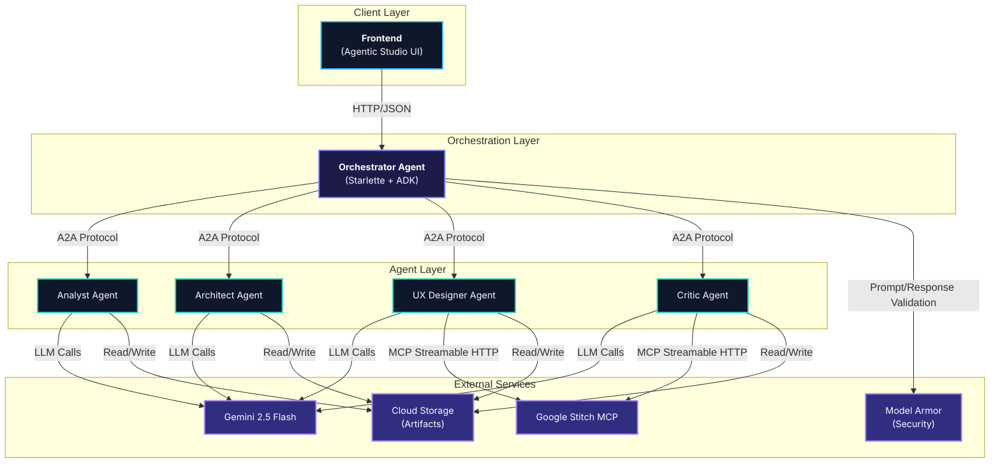
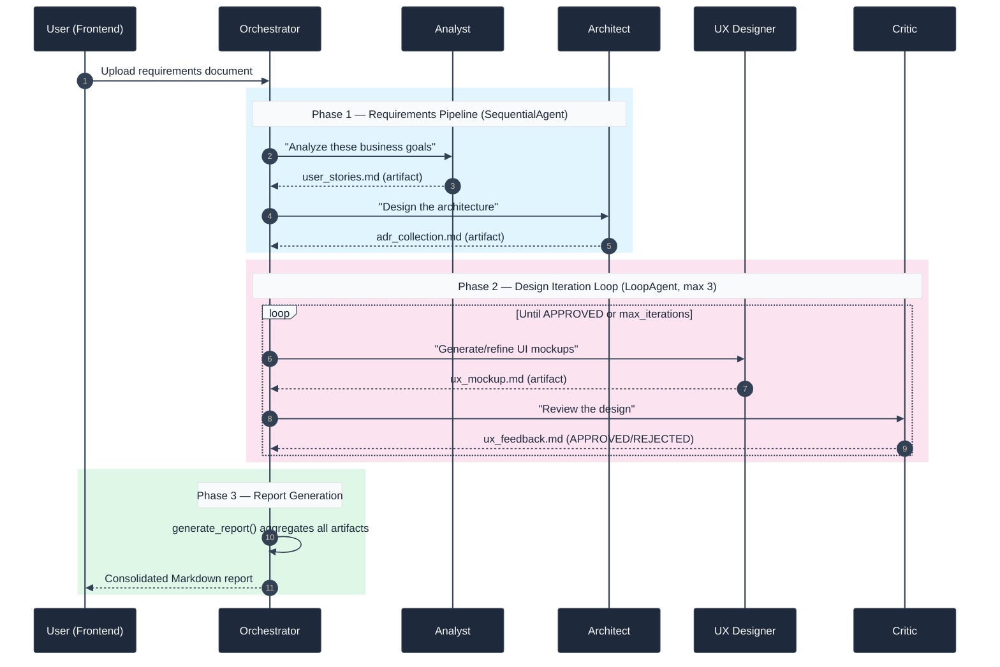
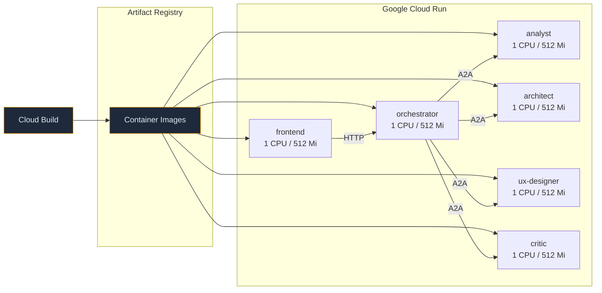

# Agentic Studio

> A decentralized Multi-Agent System that transforms high-level business goals into structured user stories, architecture decision records, and high-fidelity UI/UX mockups — all orchestrated autonomously through Google ADK and A2A protocol.

---

## Table of Contents

- [Overview](#overview)
- [Architecture](#architecture)
  - [System Diagram](#system-diagram)
  - [Agent Communication Flow](#agent-communication-flow)
  - [Deployment Architecture](#deployment-architecture)
- [Agents](#agents)
  - [Analyst Agent](#1-analyst-agent)
  - [Architect Agent](#2-architect-agent)
  - [UX Designer Agent](#3-ux-designer-agent)
  - [Critic Agent](#4-critic-agent)
  - [Orchestrator Agent](#5-orchestrator-agent)
- [Frontend](#frontend)
- [Tech Stack](#tech-stack)
- [Project Structure](#project-structure)
- [Getting Started](#getting-started)
  - [Prerequisites](#prerequisites)
  - [Environment Variables](#environment-variables)
  - [Local Development](#local-development)
  - [Docker Compose](#docker-compose)
- [Cloud Deployment (GCP Cloud Run)](#cloud-deployment-gcp-cloud-run)
- [Security](#security)
- [Contributing](#contributing)
- [License](#license)

---

## Overview

**Agentic Studio** is a Micro-Agent Architecture system designed for automated software design workflows. It coordinates five specialized AI agents — each deployed as an independent Cloud Run service — to collaboratively produce:

| Deliverable                | Agent Responsible |
| :------------------------- | :---------------- |
| Structured User Stories    | Analyst           |
| Architecture Decision Records (ADRs) | Architect   |
| High-Fidelity UI Mockups  | UX Designer       |
| Heuristic Design Reviews  | Critic            |
| Consolidated Markdown Report | Orchestrator   |

The system eliminates manual hand-offs between product, architecture, and design teams by automating the full pipeline from business goal to deliverable artifact.

---

## Architecture

### System Diagram



### Agent Communication Flow



### Deployment Architecture



---

## Agents

### 1. [Analyst Agent](./agents/analyst/README.md)

| Property       | Value                                  |
| :------------- | :------------------------------------- |
| **Role**       | User Story Analyst                     |
| **Model**      | `gemini-2.5-flash`                     |
| **Port**       | `8001`                                 |
| **Protocol**   | A2A (via `to_a2a()`)                   |
| **Tools**      | `save_document`                        |
| **Output**     | `user_stories.md`                      |

Converts high-level business goals into structured User Stories with Acceptance Criteria following the INVEST format. Each story follows the template: *"As a [role], I want to [action], so that [benefit]."*

### 2. [Architect Agent](./agents/architect/README.md)

| Property       | Value                                  |
| :------------- | :------------------------------------- |
| **Role**       | System Architect                       |
| **Model**      | `gemini-2.5-flash`                     |
| **Port**       | `8002`                                 |
| **Protocol**   | A2A (via `to_a2a()`)                   |
| **Tools**      | `get_document`, `save_document`        |
| **Input**      | `user_stories.md`                      |
| **Output**     | `adr_collection.md`                    |

Reads the Analyst's user stories and produces Architecture Decision Records (ADRs) documenting technical choices for patterns, infrastructure, and component design.

### 3. [UX Designer Agent](./agents/ux-designer/README.md)

| Property       | Value                                  |
| :------------- | :------------------------------------- |
| **Role**       | UX/UI Expert                           |
| **Model**      | `gemini-2.5-flash`                     |
| **Port**       | `8003`                                 |
| **Protocol**   | A2A (via `to_a2a()`)                   |
| **Tools**      | `get_document`, `save_document`, Stitch MCP Toolset |
| **Input**      | `adr_collection.md`, `ux_feedback.md`  |
| **Output**     | `ux_mockup.md` + Stitch project screens |

Generates high-fidelity UI mockups using [Google Stitch](https://stitch.googleapis.com) via Model Context Protocol (MCP). Iterates based on Critic feedback to refine designs.

### 4. [Critic Agent](./agents/critic/README.md)

| Property       | Value                                  |
| :------------- | :------------------------------------- |
| **Role**       | UX Critic / Heuristic Evaluator        |
| **Model**      | `gemini-2.5-flash`                     |
| **Port**       | `8004`                                 |
| **Protocol**   | A2A (via `to_a2a()`)                   |
| **Tools**      | `get_document`, `save_document`, Stitch MCP Toolset, `submit_review` |
| **Input**      | `adr_collection.md`, `ux_mockup.md`    |
| **Output**     | `ux_feedback.md` (APPROVED/REJECTED)   |

Performs heuristic evaluation of designs against technical requirements and UX principles (Usability, Accessibility, Aesthetics). Issues APPROVED/REJECTED verdicts that control the iteration loop.

### 5. [Orchestrator Agent](./agents/orchestrator/README.md)

| Property       | Value                                  |
| :------------- | :------------------------------------- |
| **Role**       | Workflow Coordinator                   |
| **Model**      | `gemini-2.5-flash`                     |
| **Port**       | `8005`                                 |
| **Protocol**   | Custom Starlette app (REST API)        |
| **Sub-Agents** | `SequentialAgent`, `LoopAgent`         |
| **Tools**      | `requirements_pipeline`, `design_iteration_loop`, `generate_report` |
| **Output**     | `final_report.md`                      |

Coordinates the entire workflow using native ADK orchestration patterns:
- **`SequentialAgent`** — Analyst → Architect (requirements phase).
- **`LoopAgent`** — UX Designer ↔ Critic (iterative design phase, max 3 iterations).
- **`generate_report`** — Aggregates all session artifacts into a single Markdown report.

Integrates **Model Armor** security guardrails for input/output validation.

---

## Frontend

**Agentic Studio UI** is a modern, glassmorphism-styled web interface that provides:

- **Document Upload** — Drag-and-drop or file picker for `.txt`, `.md` files.
- **Live Activity Feed** — Real-time event stream showing agent actions during orchestration.
- **Report Viewer** — Rendered Markdown report with all generated artifacts.
- **Session History** — Local storage-backed history of past orchestration runs.

| Technology     | Purpose                               |
| :------------- | :------------------------------------ |
| HTML5          | Structure and SEO semantics           |
| Tailwind CSS   | Utility-first styling + glassmorphism |
| Lucide Icons   | Iconography                           |
| Marked.js      | Markdown rendering                    |
| Nginx          | Production static file server         |

---

## Tech Stack

| Layer                 | Technology                                      |
| :-------------------- | :---------------------------------------------- |
| **Language**          | Python 3.12+                                    |
| **Agent Framework**   | Google ADK (Agent Development Kit)               |
| **LLM**              | Gemini 2.5 Flash                                |
| **Communication**     | A2A (Agent-to-Agent) Protocol                   |
| **UI Generation**     | Google Stitch via MCP (Model Context Protocol)  |
| **Security**          | Google Model Armor (prompt/response validation) |
| **Artifact Storage**  | GCS (Cloud) / Local filesystem (dev)            |
| **Dependency Mgmt**   | `uv` (per agent, independent)                  |
| **Containerization**  | Docker (python:3.12-slim / nginx:alpine)        |
| **Orchestration**     | Docker Compose (local) / Cloud Run (prod)       |
| **CI/CD**             | Google Cloud Build                              |
| **Frontend**          | HTML5, Tailwind CSS, Vanilla JS                 |

---

## Project Structure

```
agent-ux/
├── agents/
│   ├── analyst/                    # User Story Analyst Agent
│   │   ├── app/
│   │   │   ├── __init__.py         # Re-exports `app` for uvicorn
│   │   │   ├── agent.py            # Agent definition + A2A setup
│   │   │   └── callbacks/          # Google Cloud Logging callback
│   │   ├── tools/
│   │   │   └── artifact_tool.py    # save_document tool
│   │   ├── Dockerfile
│   │   ├── cloudbuild.yaml
│   │   └── pyproject.toml
│   │
│   ├── architect/                  # System Architect Agent
│   │   ├── app/
│   │   │   ├── agent.py            # ADR generation agent
│   │   │   └── ...
│   │   ├── tools/
│   │   │   └── artifact_tool.py    # get_document, save_document
│   │   ├── Dockerfile
│   │   └── cloudbuild.yaml
│   │
│   ├── ux-designer/                # UX/UI Expert Agent
│   │   ├── app/
│   │   │   └── agent.py            # Stitch MCP integration
│   │   ├── tools/
│   │   │   └── artifact_tool.py
│   │   ├── Dockerfile
│   │   └── cloudbuild.yaml
│   │
│   ├── critic/                     # UX Critic Agent
│   │   ├── app/
│   │   │   └── agent.py            # Heuristic evaluator + submit_review
│   │   ├── tools/
│   │   │   └── artifact_tool.py
│   │   ├── Dockerfile
│   │   └── cloudbuild.yaml
│   │
│   └── orchestrator/               # Root Orchestrator Agent
│       ├── app/
│       │   ├── agent.py            # Starlette app + ADK patterns
│       │   ├── config.py           # Sub-agent URL configuration
│       │   ├── data_models.py      # Security data models
│       │   ├── callbacks/
│       │   │   └── security.py     # Model Armor guardrails
│       │   └── services/
│       │       └── security_service.py  # Model Armor API wrapper
│       ├── tools/
│       │   └── report_tool.py      # Final report aggregation
│       ├── Dockerfile
│       └── cloudbuild.yaml
│
├── frontend/                       # Agentic Studio Web UI
│   ├── index.html
│   ├── js/
│   │   ├── config.js               # Runtime configuration
│   │   ├── app.js                  # Application state machine
│   │   ├── api.js                  # HTTP communication layer
│   │   └── ui.js                   # DOM rendering engine
│   ├── styles/
│   │   └── main.css                # Glassmorphism design system
│   ├── Dockerfile                  # nginx:alpine production image
│   ├── nginx.conf
│   ├── docker-entrypoint.sh        # Runtime URL injection
│   └── cloudbuild.yaml
│
├── shared_artifacts/               # Local dev artifact storage
├── docker-compose.yml              # Local multi-service orchestration
├── deploy-all.sh                   # Automated Cloud Run deployment
├── Design-DevHack.md               # System design specification
└── README.md                       # This file
```

---

## Getting Started

### Prerequisites

- **Python 3.12+**
- **[uv](https://docs.astral.sh/uv/)** — Fast Python package manager
- **Docker** + **Docker Compose**
- **Google Cloud SDK** (`gcloud`) — For deployment
- **GCP Project** with billing enabled

### Environment Variables

Create a `.env` file in the root directory:

```env
# GCP Configuration
GOOGLE_CLOUD_PROJECT=your-gcp-project-id
GOOGLE_CLOUD_LOCATION=us-central1
GOOGLE_GENAI_USE_VERTEXAI=true

# Artifact Storage (GCS bucket name, omit for local filesystem)
LOGS_BUCKET_NAME=your-artifacts-bucket

# Stitch MCP API Key (required by ux-designer and critic)
STITCH_API_KEY=your-stitch-api-key

# Model Armor (optional, fails open if unconfigured)
MODEL_ARMOR_PROJECT_ID=your-gcp-project-id
MODEL_ARMOR_LOCATION=us-central1
MODEL_ARMOR_TEMPLATE_ID=your-template-id
```

### Local Development

Run each agent independently in separate terminals:

```bash
# Terminal 1 — Analyst
cd agents/analyst && uv sync && uv run uvicorn app:app --host 0.0.0.0 --port 8001

# Terminal 2 — Architect
cd agents/architect && uv sync && uv run uvicorn app:app --host 0.0.0.0 --port 8002

# Terminal 3 — UX Designer
cd agents/ux-designer && uv sync && uv run uvicorn app:app --host 0.0.0.0 --port 8003

# Terminal 4 — Critic
cd agents/critic && uv sync && uv run uvicorn app:app --host 0.0.0.0 --port 8004

# Terminal 5 — Orchestrator
cd agents/orchestrator && uv sync && uv run uvicorn app:app --host 0.0.0.0 --port 8005

# Terminal 6 — Frontend (static server)
cd frontend && npx serve . -l 8080
```

### Docker Compose

Start all services with a single command:

```bash
# Build and run entire system
docker compose up --build

# Services will be available at:
#   Analyst:      http://localhost:8001
#   Architect:    http://localhost:8002
#   UX Designer:  http://localhost:8003
#   Critic:       http://localhost:8004
#   Orchestrator: http://localhost:8000
#   Frontend:     http://localhost:8080
```

---

## Cloud Deployment (GCP Cloud Run)

Each service has its own `Dockerfile` and `cloudbuild.yaml`. All services are configured with:
- **1 CPU** / **512 Mi RAM**
- **Unauthenticated access** (`--allow-unauthenticated`)
- **Port 8080** (Cloud Run standard)

### Automated Deployment

The `deploy-all.sh` script handles the dependency-ordered deployment:

```bash
# Make the script executable
chmod +x deploy-all.sh

# Deploy all services (sub-agents → orchestrator → frontend)
export STITCH_API_KEY="your-stitch-api-key"
./deploy-all.sh <PROJECT_ID> <REGION>

# Example:
./deploy-all.sh my-project us-central1
```

### Manual Per-Service Deployment

```bash
# Deploy a single agent (e.g., analyst)
cd agents/analyst
gcloud builds submit --config=cloudbuild.yaml --project=<PROJECT_ID>
```

### Deployment Order

Services must be deployed in dependency order:

```
1. analyst, architect, ux-designer, critic  (parallel, no dependencies)
2. orchestrator                             (depends on sub-agent URLs)
3. frontend                                 (depends on orchestrator URL)
```

---

## Security

### Model Armor Integration

The Orchestrator integrates Google Cloud [Model Armor](https://cloud.google.com/model-armor) as a security guardrail:

| Check                 | Phase            | Behavior                                         |
| :-------------------- | :--------------- | :----------------------------------------------- |
| Prompt Injection      | `before_model`   | Blocks request, returns security alert            |
| Sensitive Data (PII)  | `after_model`    | Redacts PII from response using sanitized content |
| Harmful Content       | `before_model`   | Blocks request if flagged                         |
| Content Safety        | `after_model`    | Blocks unsafe model output                        |

The `FailMode` is set to **`OPEN`** by default — if Model Armor is unavailable, requests pass through. Set to **`CLOSED`** for production environments where safety is critical.

### Secrets Management

| Environment | Method                                  |
| :---------- | :-------------------------------------- |
| Local dev   | `.env` files (via `python-dotenv`)      |
| Cloud Run   | Cloud Build substitutions / Secret Manager |

> **Important**: Never commit `.env` files or API keys to version control. All `.dockerignore` files exclude `.env`.

---

## Contributing

1. Fork the repository
2. Create a feature branch (`git checkout -b feature/amazing-feature`)
3. Ensure each agent remains independently deployable (own `pyproject.toml` and `Dockerfile`)
4. Follow the existing code style and naming conventions
5. Commit your changes (`git commit -m "feat: add amazing feature"`)
6. Push to the branch (`git push origin feature/amazing-feature`)
7. Open a Pull Request

---

## License

This project was built for the **DevHack Workshop** by [Aplazo](https://aplazo.com). All rights reserved.

---

<p align="center">
  <strong>Powered by</strong><br/>
  Gemini 2.5 Flash · Google ADK · Google Stitch MCP · Model Armor · Cloud Run
</p>
